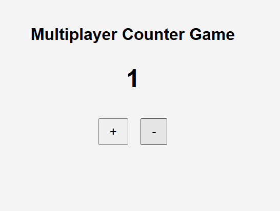

# 🔄 Real-Time Counter App

A **real-time multiplayer counter app** using **Node.js**, **Express**, and **Socket.IO** for live updates, with a frontend interface to increment or decrement the shared counter.

---

## ✨ Features

- 🔁 Real-time counter updates across multiple clients
- 📡 WebSocket-based communication using **Socket.IO**
- 🌐 CORS-enabled backend
- 💻 Simple, responsive frontend UI
- 🚀 Easy to run locally

---

## 🛠️ Tech Stack

### Backend
- **Node.js**
- **Express**
- **Socket.IO**
- **CORS**

### Frontend
- **HTML**
- **CSS**
- **JavaScript**

---

## 📁 Folder Structure

full-stack-multimedia/
- ├── public/
- │ ├── index.html
- │ ├── style.css
- │ └── script.js
- ├── server.js

---

## 🚀 Getting Started

### Prerequisites

- [Node.js](https://nodejs.org/) installed

### Installation

1. **Clone the repo**
```bash
git clone https://github.com/Xavierdivya/full-stack-multimedia.git
cd full-stack-multimedia
```
2. **install Dependencies**
```bash
npm install
```
3.Run the server
```bash
node server.js
```
4.Open the app
```bash
http://localhost:5001
```

---

## 🧠 How It Works

- When a user connects, they receive the current counter value.
- Clicking + or – sends an event to the server via Socket.IO.
- The server updates the shared counter and broadcasts the new value to all connected clients.

---

## 📸 Demo Screenshot




---

## 🙋‍♀️ Author
- Divya Xavier
- 🌐 GitHub
- 💼 LinkedIn
